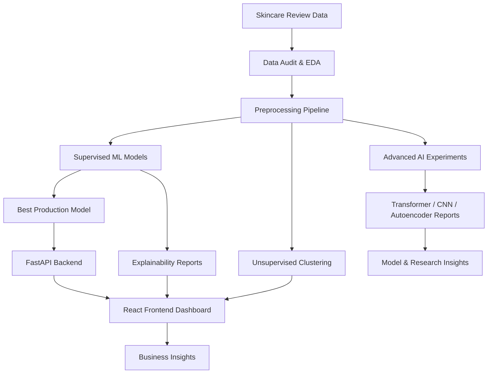

# 🌸 GlowWise AI

## Beauty & Skincare Review Intelligence powered by Machine Learning


---

## ✨ Project Overview

**GlowWise AI** is a full-stack machine learning project that analyzes skincare product reviews and turns customer feedback into clear, actionable insights.

The project predicts whether a skincare review indicates **high customer satisfaction** or **low/medium satisfaction**, explains which words influence the prediction, discovers customer segments using unsupervised learning, detects unusual reviews with anomaly detection, and serves the ML model through a FastAPI backend and a polished React frontend.

This is not only a machine learning notebook — it is a complete ML product workflow:

```text
Raw Reviews → Data Audit → Preprocessing → ML Models → Explainability → Clustering → API → Frontend Dashboard
```

The project was later extended with modern AI experiments:

```text
Transfer Learning → Text CNN → Autoencoder Anomaly Detection → TCN Future Extension
```

These extensions were used to compare model complexity, explore modern NLP, and understand how different machine learning methods can support a real review intelligence product.

---

## 💄 The Problem

Beauty and skincare companies often receive thousands of customer reviews.

Reading all reviews manually is slow, expensive, and difficult. Important patterns can be missed:

* Why do customers love a product?
* Why are some customers disappointed?
* Are people complaining about acne, irritation, texture, dryness, price, or smell?
* Which customer groups behave differently?
* Which products need improvement?

GlowWise AI solves this by automatically analyzing review text and transforming it into useful business insights.

---

## 🚀 What GlowWise AI Can Do

### 🧠 1. Predict Customer Satisfaction

The app predicts whether a review belongs to:

* `high_satisfaction`
* `low_or_medium_satisfaction`

Example:

```text
"I love this moisturizer. It makes my skin soft and glowing."
→ High Satisfaction
```

```text
"This product broke me out and made my skin irritated."
→ Low / Medium Satisfaction
```

---

### 🔍 2. Explain Model Decisions

GlowWise AI does not only predict. It also explains which words are strongly connected with positive or negative customer experiences.

Examples of positive drivers:

```text
love, amazing, great, best, perfect, holy grail, smooth
```

Examples of negative drivers:

```text
disappointed, waste, returned, worst, horrible, not worth it
```

This makes the model more understandable and useful for real business decisions.

---

### 👥 3. Discover Customer Segments

Using unsupervised learning, GlowWise AI identifies different customer groups from review text.

Discovered customer segments include:

| Segment                       | Description                                  |
| ----------------------------- | -------------------------------------------- |
| 🌸 General Beauty Enthusiasts | Broad skincare and beauty users              |
| 🧴 Daily Skincare Users       | Routine-focused skincare customers           |
| 💧 Moisture & Texture Fans    | Customers focused on hydration and skin feel |
| 🌿 Acne & Blemish Care        | Customers discussing acne-prone skin         |
| 💋 Lip Care Seekers           | Customers focused on lip balms and masks     |

This helps companies understand different customer needs and improve product strategy.

---

### 🔍 4. Detect Unusual Reviews

GlowWise AI also includes an experimental **Autoencoder anomaly detection** workflow.

Instead of predicting satisfaction directly, the autoencoder learns what typical review patterns look like. Reviews with high reconstruction error are flagged as unusual.

This can help identify:

* unusual customer feedback
* extreme review language
* possible spam or fake reviews
* emerging product issues
* reviews that may need human review

Important:

```text
Anomaly ≠ negative review
```

An anomaly means the review looks different from the majority of reviews.

---

## 🏢 Real-World Use Case

GlowWise AI could be used by:

* skincare brands
* beauty e-commerce companies
* product teams
* marketing teams
* customer service teams
* review analytics platforms

In a real company, GlowWise AI could be connected to an online store or review system through an API.

```text
Customer writes review
        ↓
Review is sent to GlowWise AI API
        ↓
ML model predicts satisfaction
        ↓
Result is saved in company dashboard
        ↓
Product and marketing teams get insights
```

With the anomaly detection extension, the system could also flag unusual reviews for human review:

```text
New review arrives
        ↓
Satisfaction prediction
        ↓
Explainability + customer segment
        ↓
Anomaly detection check
        ↓
Possible human review if the text looks unusual
```

---

## 🧪 Dataset

The project uses a large Sephora skincare review dataset.

The dataset contains real product reviews, ratings, product metadata, brand information, skin types, product categories, and review text.

Key observations from the dataset audit:

* The dataset contains over 1 million reviews.
* Ratings are highly imbalanced.
* Most reviews are positive.
* 4-star and 5-star reviews dominate the dataset.
* Accuracy alone is not enough for model evaluation.

Because of this imbalance, the project focuses strongly on:

* Macro F1-score
* Class 0 recall
* Class 0 precision
* Confusion matrix
* Precision-recall analysis

---

## 🧹 Data Preprocessing

The preprocessing pipeline includes:

* loading and merging review/product data
* handling missing values
* cleaning text
* combining review title and review body
* creating target variable `high_satisfaction`
* removing leakage columns such as rating and recommendation fields
* generating processed sample dataset
* saving preprocessing reports and figures

Target creation:

```text
Ratings 4–5 → high_satisfaction = 1
Ratings 1–3 → low_or_medium_satisfaction = 0
```

---

## 📊 Exploratory Data Analysis

The project includes a full dataset audit with visualizations such as:

* rating distribution
* sentiment distribution
* satisfaction distribution
* missing values
* top brands
* text length distribution

EDA showed that the dataset is useful but strongly imbalanced, which shaped the model evaluation strategy.

---

## 🤖 Models Tested

GlowWise AI compares classical machine learning, deep learning, transfer learning, and unsupervised learning methods.

### Classical ML Models

* Dummy Classifier
* Logistic Regression
* Tuned Logistic Regression
* LinearSVC
* Complement Naive Bayes
* SGDClassifier
* Metadata-enhanced Logistic Regression

### Advanced ML / Deep Learning Models

* KNN + TruncatedSVD
* Dense ANN / MLP
* TensorFlow/Keras Text CNN
* Sentence Transformer embeddings + Logistic Regression
* Autoencoder anomaly detection
* Unsupervised clustering with SVD/PCA + KMeans
* TCN documented as a future sequence-modeling extension

---

## 🏆 Model Performance Highlights

### Production Reference Model

The strongest production reference model was:

```text
Tuned Logistic Regression trained on 80k reviews
```

| Model                                              | Accuracy | Macro F1 |
| -------------------------------------------------- | -------: | -------: |
| 👑 Production Reference: Tuned Logistic Regression |   92.96% |   88.91% |

---

### Fair 15k Experiment Comparison

These models were compared using a fair 15k training setup.

| Rank | Model                     | Accuracy | Macro F1 | Notes                                      |
| ---: | ------------------------- | -------: | -------: | ------------------------------------------ |
| 🥇 1 | Tuned Logistic Regression |   92.05% |   87.34% | Best fair 15k model                        |
| 🥈 2 | LinearSVC                 |   92.12% |   87.04% | Very strong classical text model           |
| 🥉 3 | Text CNN                  |   90.27% |   84.89% | Real TensorFlow/Keras CNN trained in Colab |
|    4 | Dense ANN / MLP           |   86.06% |   76.57% | Neural network fallback experiment         |
|    5 | KNN + SVD                 |   83.20% |   70.37% | Useful course experiment, weaker for text  |

---

## 🧠 TensorFlow / Keras Text CNN

A real Text CNN was trained in Google Colab with GPU acceleration.

CNN architecture:

```text
TextVectorization
        ↓
Embedding
        ↓
Conv1D
        ↓
GlobalMaxPooling1D
        ↓
Dense
        ↓
Dropout
        ↓
Sigmoid Output
```

CNN results:

| Metric            |         Score |
| ----------------- | ------------: |
| Accuracy          |        90.27% |
| Macro F1          |        84.89% |
| Weighted F1       |        90.67% |
| Class 0 Recall    |        85.43% |
| Class 0 Precision |        68.23% |
| ROC-AUC           |        95.57% |
| PR-AUC            |        98.92% |
| Training Time     | 14.75 seconds |

The CNN performed well, but it did not outperform the best classical TF-IDF models.

This was an important insight:

> More complex models do not automatically perform better.

---

## 🌐 Transfer Learning & Advanced AI Extensions

To connect the project to more advanced NLP and deep learning concepts, GlowWise AI was extended with several experimental AI workflows.

---

### 1. Transformer / Transfer Learning

A pre-trained Sentence Transformer model was used as a feature extractor.

Instead of representing reviews only with TF-IDF word counts, review text was converted into dense semantic embeddings.

A Logistic Regression classifier was then trained on top of these embeddings.

| Model                | Accuracy | Macro F1 | Class 0 Recall |
| -------------------- | -------: | -------: | -------------: |
| Production LR TF-IDF |   93.0%  |   88.9%  |          90.9% |
| Text CNN             |   90.3%  |   84.9%  |          85.4% |
| Transformer + LR     |   84.6%  |   78.3%  |          85.5% |

The transformer experiment showed that semantic embeddings can capture useful minority-class signals, but the production TF-IDF + Logistic Regression model remained stronger overall.

This was another important insight:

> A modern model is valuable to test, but production decisions should be based on real performance, explainability, speed, and deployment cost.

---

### 2. Autoencoder Anomaly Detection

An autoencoder was trained to reconstruct dense review representations created using TF-IDF and TruncatedSVD.

Pipeline:

```text
Review Text → TF-IDF → SVD → Autoencoder → Reconstruction Error
```

Reviews with reconstruction error above the 95th percentile were flagged as anomalies.

| Metric | Result |
| ------ | -----: |
| Sample size | 20,000 reviews |
| Epochs trained | 50 |
| Anomaly threshold | 0.00309 |
| Flagged anomalies | 1,000 reviews |

This adds a review monitoring layer to the project.

The model can help surface unusual reviews that may need human attention, such as extreme feedback, unusual wording, possible spam, or emerging product issues.

Important:

```text
Autoencoder anomaly detection is not used as the production satisfaction classifier.
It complements the system by adding review quality monitoring.
```

---

### 3. TCN Future Extension

A Temporal Convolutional Network was documented as a future sequence-modeling extension.

A possible future pipeline:

```text
Review Text → Tokenization → Embedding → TCN Blocks → Classification
```

TCN was not implemented in the production system because the project already includes strong classical ML, deep learning, transformer, and autoencoder experiments.

It remains a future research direction for modeling longer phrase patterns in review text, such as:

```text
"broke me out"
"not worth it"
"holy grail"
"wanted to love it but..."
```

---

## 🧠 Final Model Decision

The final production model remains:

```text
Tuned Logistic Regression with TF-IDF
```

Why?

* strong performance
* high macro F1
* high minority-class recall
* fast inference
* easy deployment
* interpretable coefficients
* works well with text data
* simple to serve through FastAPI
* easier to maintain than deep learning models

The deep learning, transfer learning, and anomaly detection experiments were still valuable because they demonstrated a broader advanced ML workflow and helped compare model complexity against real performance.

---

## 📈 Evaluation Strategy

Because the dataset is imbalanced, the project does not rely only on accuracy.

Evaluation includes:

* Accuracy
* Macro F1-score
* Weighted F1-score
* Class 0 recall
* Class 0 precision
* Confusion matrix
* ROC-AUC
* Precision-recall curves
* Training vs validation curves for neural networks
* Reconstruction error distribution for anomaly detection

Important focus:

```text
Detecting low_or_medium_satisfaction is critical because dissatisfied customers are the minority but business-important group.
```

---

## 🔎 Explainability

The project includes model explainability using logistic regression coefficients.

This helps answer:

* What words push the model toward high satisfaction?
* What words push the model toward low/medium satisfaction?
* What language patterns matter in skincare reviews?

Examples:

| Positive Signals | Negative Signals |
| ---------------- | ---------------- |
| love             | disappointed     |
| amazing          | waste            |
| perfect          | returned         |
| holy grail       | worst            |
| smooth           | horrible         |

---

## 👥 Unsupervised Learning

The project also uses unsupervised learning to discover customer segments.

Techniques used:

* TF-IDF
* TruncatedSVD
* PCA visualization
* MiniBatchKMeans
* cluster profiling
* cluster examples

This part demonstrates how unsupervised learning can generate business hypotheses from review data.

Example insight:

```text
Moisture & Texture Fans showed the highest satisfaction rate, suggesting that sensory product experience is very important in skincare.
```

---

## 🔍 Anomaly Detection

The project also includes an experimental autoencoder workflow for anomaly detection.

Unlike satisfaction classification, anomaly detection does not predict whether a review is positive or negative.

Instead, it asks:

```text
Does this review look unusual compared with most other reviews?
```

The autoencoder learns to reconstruct normal review representations. Reviews with high reconstruction error are flagged as unusual.

Business use cases:

* quality control
* possible spam/fake review detection
* early warning for unusual product issues
* human review prioritization
* monitoring extreme customer feedback

This makes GlowWise AI more than a prediction system — it becomes a review intelligence and monitoring workflow.

---

## 🏗️ System Architecture



---

## 🧬 ML Workflow

```mermaid
flowchart LR
    A[Raw Data] --> B[Cleaning]
    B --> C[Feature Engineering]
    C --> D[Baseline Model]
    D --> E[Model Comparison]
    E --> F[Explainability]
    F --> G[Clustering]
    G --> H[Advanced ML]
    H --> I[Transfer Learning]
    I --> J[Anomaly Detection]
    J --> K[API]
    K --> L[Frontend]
```



---

## 🖥️ Frontend Demo

The frontend is built with:

* React
* TypeScript
* Vite
* custom beauty/skincare UI
* premium GlowWise visual design

The dashboard allows users to:

* enter a skincare review
* predict customer satisfaction
* view model confidence
* explore positive and negative driver terms
* see customer segments
* understand the ML project journey

The design goal was to make the project feel like a real skincare intelligence product, not only a technical dashboard.

---

## ⚙️ Backend API

The backend is built with FastAPI.

Main endpoints:

| Endpoint                         | Description                           |
| -------------------------------- | ------------------------------------- |
| `GET /health`                    | API health check                      |
| `GET /api/model/status`          | Check model loading status            |
| `POST /api/predict/satisfaction` | Predict satisfaction from review text |
| `GET /api/insights/top-terms`    | Get explainability terms              |
| `GET /api/insights/clusters`     | Get customer cluster profiles         |
| `GET /api/insights/summary`      | Get model and insight summary         |

---

## 💼 Business Value

GlowWise AI can support beauty and skincare teams by turning review text into decision-ready insight.

| Business Value | How GlowWise AI Supports It |
| -------------- | ---------------------------- |
| 🌸 Faster customer insight | Analyze thousands of reviews faster than manual reading |
| ⚠️ Early detection of dissatisfaction | Identify low/medium satisfaction signals before they become bigger product issues |
| 🧪 Better product development | Understand what customers love or dislike about texture, hydration, breakouts, irritation or product feel |
| 👥 Customer segmentation | Discover review-based customer personas with unsupervised learning |
| 🔍 Review quality monitoring | Flag unusual reviews using autoencoder anomaly detection |
| 🧠 Advanced NLP decision support | Compare classical ML, deep learning, transformer embeddings and anomaly detection |
| 📊 Data-driven beauty strategy | Support product, marketing and customer experience teams with real review data |

---

## 🧰 Tech Stack

| Area                     | Tools                                         |
| ------------------------ | --------------------------------------------- |
| Language                 | Python, TypeScript                            |
| ML                       | scikit-learn                                  |
| Deep Learning            | TensorFlow / Keras                            |
| Transfer Learning        | Sentence Transformers                         |
| NLP                      | TF-IDF, TextVectorization, Embeddings         |
| Clustering               | KMeans, MiniBatchKMeans                       |
| Dimensionality Reduction | TruncatedSVD, PCA                             |
| Anomaly Detection        | Autoencoder, Reconstruction Error             |
| Future Extension         | TCN concept documentation                     |
| Backend                  | FastAPI                                       |
| Frontend                 | React, Vite, TypeScript                       |
| Visualization            | Matplotlib                                    |
| Notebook                 | Jupyter, Google Colab                         |
| Deployment               | Render, Vercel                                |
| Version Control          | Git, GitHub                                   |

---

## 📁 Project Structure

```text
glowwise-ai/
│
├── backend/
│   └── app/
│       ├── api/
│       ├── core/
│       ├── models/
│       ├── services/
│       └── main.py
│
├── frontend/
│   └── src/
│       ├── services/
│       ├── types/
│       ├── App.tsx
│       └── index.css
│
├── ml/
│   ├── notebooks/
│   │   ├── 01_dataset_audit.ipynb
│   │   ├── 02_data_preprocessing.ipynb
│   │   ├── 03_baseline_model.ipynb
│   │   ├── 04_model_comparison.ipynb
│   │   ├── 05_model_explainability.ipynb
│   │   ├── 06_clustering_insights.ipynb
│   │   ├── 07_deep_learning_experiments.ipynb
│   │   ├── 08_text_cnn_colab.ipynb
│   │   ├── 09_transformer_transfer_learning.ipynb
│   │   └── 10_autoencoder_anomaly_detection.ipynb
│   │
│   ├── src/
│   │   ├── load_data.py
│   │   ├── preprocess_data.py
│   │   ├── train_baseline.py
│   │   ├── model_comparison.py
│   │   ├── model_explainability.py
│   │   ├── clustering_insights.py
│   │   ├── deep_learning_experiments.py
│   │   ├── run_transformer_experiment.py
│   │   └── run_autoencoder_anomaly.py
│   │
│   └── reports/
│       ├── figures/
│       ├── deep_learning_summary.md
│       ├── model_comparison_summary.md
│       ├── model_explainability_summary.md
│       ├── clustering_summary.md
│       ├── transformer_transfer_learning_summary.md
│       ├── autoencoder_anomaly_summary.md
│       └── tcn_future_extension.md
│
├── data/
│   ├── raw/
│   └── processed/
│
└── README.md
```

---

## 🚀 How to Run the Project

### 1. Clone the repository

```bash
git clone https://github.com/your-username/glowwise-ai.git
cd glowwise-ai
```

---

### 2. Run the backend

```bash
cd backend
pip install -r requirements.txt
uvicorn app.main:app --reload
```

Backend runs at:

```text
http://localhost:8000
```

Swagger API docs:

```text
http://localhost:8000/docs
```

---

### 3. Run the frontend

Open a new terminal:

```bash
cd frontend
npm install
npm run dev
```

Frontend runs at:

```text
http://localhost:5173
```

---

### 4. Run ML experiments

From the project root:

```bash
python ml/src/deep_learning_experiments.py
```

For the optional Text CNN experiment, open:

```text
ml/notebooks/08_text_cnn_colab.ipynb
```

in Google Colab with GPU enabled.

Additional advanced experiments:

```text
ml/notebooks/09_transformer_transfer_learning.ipynb
ml/notebooks/10_autoencoder_anomaly_detection.ipynb
```

The TCN extension is documented as future work:

```text
ml/reports/tcn_future_extension.md
```

---

## 🧪 Example Prediction

Input review:

```text
I absolutely love this moisturizer. It makes my skin feel soft, smooth and glowing. I would definitely recommend it.
```

Expected prediction:

```text
high_satisfaction
```

Input review:

```text
I was disappointed. This product broke me out and made my skin irritated. I would not buy it again.
```

Expected prediction:

```text
low_or_medium_satisfaction
```

---

## 🎯 What I Learned

This project helped me practice the complete machine learning lifecycle:

* understanding a real-world dataset
* cleaning and preparing data
* handling imbalanced classes
* creating target variables
* training baseline models
* comparing multiple algorithms
* evaluating models beyond accuracy
* using explainability
* applying unsupervised learning
* testing neural networks and CNNs
* applying transfer learning with transformer embeddings
* using autoencoders for anomaly detection
* understanding reconstruction error and outlier detection
* documenting TCN as a future sequence-modeling extension
* building a backend API
* creating a frontend dashboard
* deploying a full-stack ML application
* thinking like both a developer and a product builder

---

## 🧠 Final Reflection

The most important insight from this project:

> The most complex model is not always the best model.

Although ANN, CNN, and Transformer-based models were tested, the tuned Logistic Regression model remained the strongest production choice because it provided the best balance between performance, interpretability, speed, and deployment simplicity.

Later experiments with Transformer embeddings and Autoencoder anomaly detection expanded the project beyond basic classification. These extensions showed how modern NLP and unsupervised deep learning can support a broader review intelligence workflow.

The final system therefore demonstrates not only prediction, but also explanation, segmentation, anomaly detection, deployment, and product-oriented AI thinking.

GlowWise AI is therefore both a technical machine learning project and a product-oriented AI solution for real-world customer insight.

---

## 🌸 GlowWise AI

**From skincare reviews to intelligent beauty insights.**

```text
Understand customers faster.
Improve products smarter.
Build beauty with data.
```

---

## 🌐 Live Demo

🚀 **Frontend Demo:**  
https://glowwise-ai.vercel.app/

⚙️ **Backend API:**  
https://glowwise-ai.onrender.com

📡 **API Health Check:**  
https://glowwise-ai.onrender.com/health

🧠 **Model Status:**  
https://glowwise-ai.onrender.com/api/model/status

---