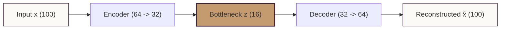

# GlowWise AI - Autoencoder Anomaly Detection Experiment Summary 🧠🔍

> [!WARNING]
> **Experimental Extension Status**:
> This module is an experimental ML extension for identifying unusual review texts. It is **not** integrated into the production FastAPI backend or the satisfaction prediction workflow. The current production model remains **Tuned Logistic Regression (TF-IDF)**. Real figures and detailed anomaly metrics are pending execution of the Google Colab notebook (`ml/notebooks/10_autoencoder_anomaly_detection.ipynb`).

---

## 📊 Conceptual Framework

### 1. What is an Autoencoder?
An **Autoencoder** is a type of unsupervised artificial neural network used to learn efficient data codings (representations) in a low-dimensional space. It consists of two main components:
* **Encoder**: Compresses the high-dimensional input vector $x$ (in our case, a 100-dimensional dense SVD representation of a review) into a lower-dimensional bottleneck representation $z$ (16 dimensions).
* **Decoder**: Attempts to reconstruct the original input vector from the bottleneck representation, producing $\hat{x}$.

During training, the network updates its weights to minimize the difference between the input $x$ and the reconstructed output $\hat{x}$.



### 2. What is Reconstruction Error?
**Reconstruction Error** is the metric used to measure how well the autoencoder can reconstruct the input. Specifically, we compute the **Mean Squared Error (MSE)** between the original dense review representation and its reconstructed version:

$$\text{Reconstruction Error} = \frac{1}{N}\sum_{i=1}^{N}(x_i - \hat{x}_i)^2$$

### 3. Why High Reconstruction Error Signals Anomalies
Since the autoencoder is trained on the majority of reviews, it learns the common linguistic structures, product descriptions, and vocabularies typical of the dataset. 
* **Standard Reviews**: Use typical combinations of words (e.g. skin types, product textures, standard sentiments) that map to regions in SVD space well-represented in the training data. The autoencoder easily compresses and reconstructs them, yielding **low reconstruction error**.
* **Unusual Reviews**: Contain rare terms, highly unique syntax, unrelated topics (e.g., spam, irrelevant URLs), or extremely mixed signals that deviate from normal reviews. The encoder fails to represent these unique features in the tight 16-dimensional bottleneck, leading to a poor reconstruction and **high reconstruction error**.

---

## 💼 Business Applications

Unsupervised anomaly detection supports review platforms in several distinct ways:
1. **Content Quality Control & Spam Detection**: Automatically flags reviews containing gibberish, copy-paste spam, promotional links, or off-topic text, preventing them from diluting product intelligence.
2. **Emerging Product / Safety Issues**: Identifies highly unique user complaints (e.g., severe skin irritation, unusual product side-effects, or changes in formulation) that would otherwise go unnoticed under a simple classification model.
3. **Fraud Detection & Bot Activity**: Reviews generated by bots or copywriters often share highly formulaic or repetitive text patterns, causing them to exhibit abnormal representations compared to authentic human experiences.
4. **Optimizing Moderation Workflows**: Instead of manually auditing thousands of reviews, human moderators can prioritize reviews flagged above the 95th percentile threshold, dramatically increasing auditing efficiency.

---

## ⚖️ Anomaly Detection vs. Supervised Classification

| Dimension | Supervised Classification (Production LR) | Unsupervised Anomaly Detection (Autoencoder) |
| :--- | :--- | :--- |
| **Objective** | Predict a specific target label (`high_satisfaction`). | Find data points that deviate from the normal distribution. |
| **Labels Required** | Yes (requires ratings or label annotations). | No (purely unsupervised representation learning). |
| **Detection Scope** | Limited to predefined classes (satisfaction level). | Capable of flags any out-of-distribution text pattern. |
| **Output Type** | Probability of high satisfaction (0.0 to 1.0). | Continuous reconstruction error (MSE). |

---

## ⚠️ Limitations & Technical Constraints

* **Anomalous $\neq$ Bad**: An anomaly represents a review that is statistically *unusual*, not necessarily *negative*. A review praising a product in highly creative poetry, or discussing a highly specific medical condition, is an anomaly but represents valid, positive feedback. Human oversight remains necessary.
* **Lossy SVD Representation**: Reducing TF-IDF features to 100 components using TruncatedSVD is computationally efficient but discards fine-grained sequence structure, word order, and negations.
* **Cold Start & Re-training**: The autoencoder relies on vocabulary patterns established during training. As brand names, cosmetic trends, and slang words evolve, the autoencoder must be periodically retrained to adapt its definition of "normal."

---

## 🔗 Complementarity within GlowWise AI

The Autoencoder Anomaly Detection module fits neatly as a complementary component in the GlowWise AI intelligence framework:

```
  ┌─────────────────────────────────────────────────────────────┐
  │                   Sephora Skincare Review                   │
  └──────────────────────────────┬──────────────────────────────┘
                                 │
         ┌───────────────────────┼────────────────────────┐
         ▼                       ▼                        ▼
┌─────────────────┐    ┌───────────────────┐    ┌───────────────────┐
│   Supervised    │    │   Unsupervised    │    │   Unsupervised    │
│  Satisfaction   │    │    Clustering     │    │ Anomaly Detection │
│  Classifier     │    │    (Customer)     │    │   (Autoencoder)   │
├─────────────────┤    ├───────────────────┤    ├───────────────────┤
│ Predicts if review │ │ Groups reviews    │    │ Flags reviews     │
│ is high or low  │    │ into personas and │    │ with extreme MSE  │
│ satisfaction.   │    │ skin-type profiles│    │ for inspection.   │
└────────┬────────┘    └───────────────────┘    └─────────┬─────────┘
         │                                                │
         ▼                                                ▼
┌─────────────────┐                             ┌───────────────────┐
│ Explainability  │                             │ Human Moderation  │
│    (SHAP)       │                             │     Workflow      │
└─────────────────┘                             └───────────────────┘
```

1. **Supervised Classifier**: Predicts user satisfaction.
2. **Explainability**: Highlights specific words driving the classifier's predictions.
3. **Clustering Insights**: Groups reviews to identify customer personas (e.g. skin types, product usage frequencies).
4. **Autoencoder Anomaly Detection**: Acts as a safety filter to flag out-of-distribution reviews for audit.
