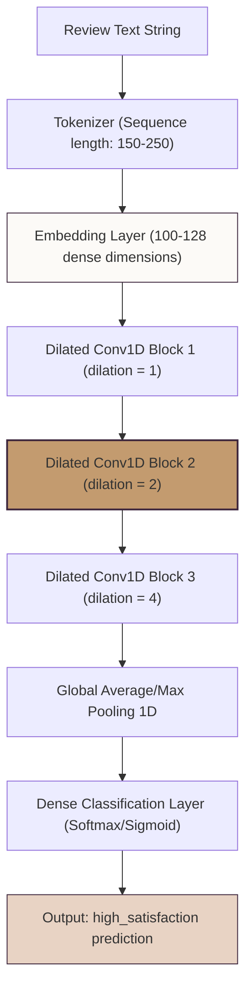

# TCN Future Extension for GlowWise AI

## 📝 Executive Summary

This report documents a future research extension for the GlowWise AI project, connecting review text classification to **Temporal Convolutional Networks (TCN)** and sequence modeling. 

> [!NOTE]
> **Research Status**: 
> The TCN pipeline is not implemented or trained in the current version of the codebase. This report serves as a theoretical and architectural framework to connect the GlowWise AI project to sequence modeling topics. The current production model remains **Tuned Logistic Regression on TF-IDF** due to its sub-millisecond latency, compact deployment footprint, and high interpretability.

---

## 🧠 What is a TCN?

A **Temporal Convolutional Network (TCN)** is a family of deep neural network architectures specifically designed for modeling sequential data (such as time series, audio waveforms, or natural language sequences). It combines the efficiency of 1D convolutional layers with structural constraints that make it suitable for sequence processing:

1. **Causal Convolutions**: A convolution is causal if the prediction at time step $t$ depends only on inputs up to time step $t$, ensuring that no information from the future leaks into the past.
2. **Dilated Convolutions**: To capture long-range dependencies efficiently without needing massive kernel sizes or pooling layers, TCNs introduce a dilation factor $d$. The kernel is applied over an area larger than its size by skipping input steps with a step size of $d$. This allows the receptive field to grow exponentially with the number of layers.
3. **Residual Connections**: TCNs utilize residual blocks containing convolutions, weight normalization, activation layers, and dropout, allowing deep architectures to train stably without vanishing gradients.

```
Dilated Convolution (dilation d = 2, kernel size k = 3):

Layer 2 (Reconstructed)     o       o       o       o
                           / \     / \     / \     / \
                          /   \   /   \   /   \   /   \
Layer 1 (Dilated)       o   o   o   o   o   o   o   o   o
                       / \ / \ / \ / \ / \ / \ / \ / \ / \
Input Sequence        x0  x1  x2  x3  x4  x5  x6  x7  x8  x9
```

---

## 🧴 Why TCN is Relevant for Skincare Reviews

Natural language text is fundamentally an ordered sequence of tokens (words or subwords). While bag-of-words approaches ignore syntax, review meaning often depends heavily on both local phrases and longer-range sequence contexts:

* **Negations & Transition Qualifiers**: Phrases like *"wanted to love it but it dried out my skin"* or *"not worth it"* rely on sequence order. The meaning of "love" is inverted by "but" later in the sequence.
* **Skincare Idioms**: Multi-word expressions such as *"broke me out"* or *"holy grail"* act as highly cohesive semantic units. 
* **Long-Range Contexts**: A user might describe their skin type at the beginning of a review, list three products they tried, and express their final satisfaction at the very end. 

A TCN utilizes its dilated receptive field to learn both local phrase-level patterns (like traditional CNNs) and longer sequence-level contexts (like LSTMs) without the recurrent bottleneck.

---

## 📐 Proposed TCN Architecture for GlowWise AI

If implemented, a future sequence classification pipeline for predicting review satisfaction (`high_satisfaction`) would look as follows:



In spirit, this architecture is very similar to the existing Text CNN experiment already documented in the project. However, while a standard Text CNN applies sliding filters over localized windows (typically size 3, 4, or 5), the TCN stacked dilated blocks expand the receptive field exponentially, capturing long-range contextual relationships across the entire review.

---

## ⚖️ Conceptual Comparison of Project Models

| Model Architecture | Strengths | Weaknesses | Best Use Case |
| :--- | :--- | :--- | :--- |
| **TF-IDF + Logistic Regression** *(Current Production)* | Sub-millisecond latency, compact footprint (~10MB), completely interpretable, extremely stable. | Ignores word order, syntax, and synonyms. | **Production Deployment** |
| **Text CNN** *(Experimental)* | Fast training, excellent at capturing localized keywords and phrases. | Fixed receptive field limits capture of long-range text context. | **Local phrase-pattern modeling** |
| **Transformer Transfer Learning** *(Experimental)* | Deep semantic representation, pre-trained on generic language contexts. | Large model files (~100MB+), high latency, memory-intensive inference. | **High-accuracy semantic mapping** |
| **TCN (Temporal Convolutional Network)** *(Future Extension)* | Captures sequential context with 1D dilated convolutions, processes tokens in parallel (no recurrent bottleneck). | Requires tuning kernel sizes and dilation rates, needs custom tokenization and padding. | **Parallelized sequence modeling** |

---

## 🔍 Why TCN Was Not Implemented in the Current Version

The GlowWise AI project is already equipped with a diverse range of modeling experiments:
1. **Classical Baseline comparison** (LR, LinearSVC, KNN, MLP).
2. **Convolutional Deep Learning** (Text CNN).
3. **Transformer Transfer Learning** (Feature extraction on pre-trained MiniLM).
4. **Autoencoder Anomaly Detection** (MSE reconstruction error for quality audit).

Introducing a fully trained TCN would require significant extra time for hyperparameter tuning (kernel sizes, dilation structures, stack depths) and tokenization validation. Since production requirements favor the highly interpretable, fast, and light TF-IDF + Logistic Regression model, TCN is best positioned as a dedicated future extension for sequence research rather than a rushed addition.

---

## 🧪 Future Experimental Design

To evaluate TCN performance against our baseline, the following experiment is proposed:

### 1. Preprocessing & Input Settings
* **Target Variable**: `high_satisfaction` (Rating 4-5 = 1, Rating 1-3 = 0).
* **Split Strategy**: Stratified 80% train / 20% test split with `random_state=42`.
* **Tokenization**: Subword tokenizer (e.g. WordPiece or BPE) or word-level tokenization.
* **Sequence Constraints**: Padding/truncating sequences to a fixed length of **150 to 250 tokens** to cover the majority of Sephora reviews.
* **Embeddings**: An input embedding layer mapping tokens to a **100 to 128-dimensional** vector space (initialized randomly or using pre-trained GloVe/Word2Vec).

### 2. Model Structure
* **Convolutional Layers**: 2 to 3 dilated Conv1D blocks with dilation rates $[1, 2, 4]$ and kernel size $k=3$.
* **Regularization**: Dropout (0.2) after convolutional layers, and L2 regularization to prevent overfitting.
* **Optimizer**: Adam optimizer with a learning rate of $0.001$ and an `EarlyStopping` callback (monitoring validation loss).

### 3. Evaluation & Baselines
The model should be evaluated using the project's standard classification metrics:
* **Metrics**: Accuracy, Macro F1, Weighted F1, Class 0 Recall, Class 0 Precision, ROC-AUC, and PR-AUC.
* **Comparison Targets**:
  * Production TF-IDF + Logistic Regression.
  * Experimental Text CNN.
  * Transformer transfer learning classifier.

---

## 💼 Business Relevance & Rationale

Implementing a sequence-based TCN would support business operations under specific criteria:
1. **Nuanced Sentiment Recognition**: TCN can help detect reviews that start positive but pivot to negative (e.g., *"the texture is amazing, but it broke me out after two days"*), which bag-of-words models often misclassify due to positive terms.
2. **Parallelized Scaling**: Unlike Recurrent Neural Networks (RNNs/LSTMs) which must process tokens sequentially step-by-step, TCNs run convolutions in parallel across the sequence, allowing fast training and inference scaling on hardware accelerators.
3. **Production Feasibility Warning**: A TCN should only replace the production Logistic Regression model if it demonstrates a statistically significant improvement in Macro F1 and Class 0 Recall while maintaining the latency constraints of the live application.
